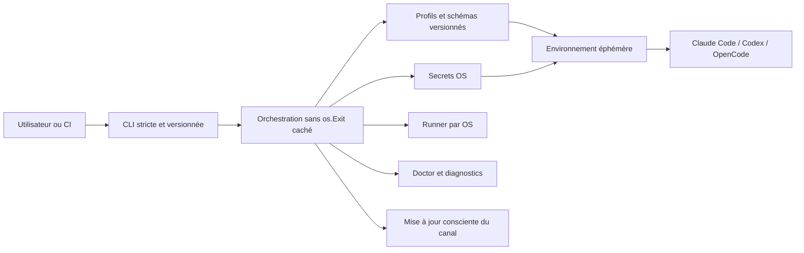

# Synthèse exécutive — audit complet BMAD+ de multiai

**Date :** 2026-07-14
**Révision de départ :** `5808769b611b4aa626f50d82482ebc436969d4d6`
**Pilotage :** Nexus, avec Atlas, Forge et Sentinel en parallèle
**Décision de release :** **NO-GO pour v0.6.7**
**Incident PATH Windows demandé :** **corrigé dans le worktree, non publié**

## Verdict en une minute

multiai possède un bon cœur technique et une proposition de valeur réelle. Son
architecture locale, ses profils, l'isolation des environnements et les stores
de secrets natifs peuvent en faire une référence. Le projet n'est toutefois pas
encore livrable comme « le meilleur » : plusieurs frontières de confiance et
contrats publics ne sont pas fiables de bout en bout.

Le problème Windows signalé est résolu pour le parcours recommandé :

```powershell
npx --yes --allow-scripts=multiai multiai@latest install
```

Ce parcours découvre le vrai préfixe npm, vérifie `multiai.cmd`, ajoute le
préfixe au `PATH` utilisateur de façon idempotente, détecte un ancien shim
prioritaire et smoke-teste la commande via le PATH persistant. Les **25 tests
npm sont verts**. Le seul contrôle Windows encore requis avant publication est
une installation `Apply` du tarball final dans une VM propre, suivie d'une
nouvelle console `cmd` et PowerShell.

La publication reste bloquée par quatre risques indépendants :

1. une configuration projet non approuvée peut appliquer des hooks ou détourner
   des secrets ;
2. un nom issu du registre communautaire peut sortir du répertoire attendu ;
3. l'auto-update n'installe pas durablement la version, peut quitter depuis une
   tâche de fond et n'impose pas une authenticité forte ;
4. le workflow de release réellement exécuté ne possède pas toutes les gates de
   sa copie renforcée.

## Description du projet

> **multiai est un plan de contrôle local pour les assistants de développement
> en ligne de commande.**

À partir d'un profil, il choisit Claude Code, Codex CLI ou OpenCode, injecte
uniquement les paramètres et secrets nécessaires, puis laisse le client natif
dialoguer directement avec le fournisseur. Il ne devrait pas devenir un proxy
LLM généraliste : sa différenciation est une politique locale, portable et
auditable entre plusieurs CLI.

Le positionnement recommandé est :

> **Le local-first AI coding CLI control plane : un seul lanceur, des profils
> reproductibles, des secrets isolés et aucun lock-in vers un assistant.**

## Scores consolidés

| Axe | Agent | Note | Lecture |
|---|---|---:|---|
| Produit et fonctionnalités | Atlas | **6,1/10** | Valeur différenciante, premier contact et promesses publiques fragiles. |
| Architecture et code | Forge | **5,9/10** | Cœur lisible, contrats et livraison incohérents. |
| Qualité, sécurité et release | Sentinel | **5,4/10** | Bonnes primitives locales, quatre bloqueurs de confiance. |
| **Maturité consolidée** | Nexus | **5,8/10** | Moyenne des trois audits ; la sécurité impose le NO-GO. |

Le potentiel estimé après fermeture des P0/P1 est supérieur à **8/10**. Il ne
demande pas davantage de fournisseurs : il demande des contrats stricts, une
installation vérifiable et une livraison fail-closed.

## Forces à préserver

- 37 profils et 13 fournisseurs déclarés, avec Claude Code, Codex et OpenCode ;
- isolation explicite de l'environnement entre lancements ;
- credential stores natifs et absence de dépendances runtime dans le package npm ;
- packages Go lisibles, peu couplés et dotés d'une base de tests significative ;
- fallback, découverte OpenRouter et écritures atomiques déjà utiles ;
- bootstrap npm désormais défensif sur Windows.

## Risques prioritaires

| Priorité | Risque | Impact | Décision attendue |
|---|---|---|---|
| P0/P1 | Confiance implicite de `.multiai.yaml` et des hooks | RCE ou exfiltration dans un dépôt non fiable | Approbation liée au chemin et à l'empreinte ; hooks désactivés avant confiance. |
| P0/P1 | Traversée de répertoire du registre | Écriture arbitraire avec les droits utilisateur | Nom strict, confinement `filepath.Rel`, taille et checksum obligatoires. |
| P0/P1 | Updater temporaire, interruptif et fail-open | Ancienne version persistante ou exécution non authentifiée | Notification seule immédiatement ; update par canal ou swap atomique signé. |
| P0/P1 | Workflow racine divergent | Artefact publié sans qualification du SHA | Une seule source, tests multi-OS requis, environnement protégé, outils pinés. |
| P1 | Contrats YAML/projet/hooks différents des guides | Politiques silencieusement ignorées | Schémas versionnés, décodage strict et exemples docs exécutés en CI. |
| P1 | CLI/JSON/options et canaux documentés non contractuels | Automatisation cassée et perte de confiance | Registre unique de commandes et manifeste de canaux réellement testés. |

## Correctif PATH Windows

### Cause

L'ancien installateur validait directement le JavaScript présent sous
`npm root --global`. Ce test prouvait que le package existait, mais contournait
le shim `multiai.cmd` et la résolution du shell. Aucun code ne demandait
`npm prefix --global` ni ne persistait ce préfixe dans le PATH utilisateur.

### État final du correctif

- traitement de `install` avant la recherche du binaire temporaire npx ;
- résolution du vrai préfixe global, y compris un `--prefix` personnalisé ;
- validation locale `X:\\...`, avec refus relatif, UNC, device, `;`, NUL,
  CR et LF ;
- écriture au scope User via .NET, sans administrateur et sans `setx` ;
- normalisation, déduplication, mutex, relecture et vérification après écriture ;
- reconstruction exacte de `Machine PATH + User PATH` ;
- échec si le premier `multiai.cmd` réel n'est pas le shim attendu ;
- appel de PowerShell et `cmd.exe` par leurs chemins système ;
- échappatoire entreprise `MULTIAI_SKIP_PATH_UPDATE=1` ;
- documentation explicite : `npm install -g multiai` seul ne répare pas le
  PATH ; le parcours automatisé est la commande `npx ... install`.

Un processus ne peut pas réécrire l'environnement du terminal parent déjà
ouvert. Le helper persiste donc la valeur pour les **nouveaux** processus et
demande d'ouvrir un nouveau terminal.

## Architecture cible



## Gate avant toute publication

- [ ] confiance explicite des configurations projet ;
- [ ] confinement du registre et téléchargements bornés ;
- [ ] auto-update rendu notification-only ou persistant, atomique et signé ;
- [ ] workflow racine unique avec tests, vet, race et sécurité obligatoires ;
- [ ] matrice CI macOS, Ubuntu et Windows verte pour le même SHA ;
- [ ] E2E du tarball final sur une VM Windows vierge et nouvelle console ;
- [ ] documentation ramenée aux canaux, commandes et contrats réellement livrés.

La décision mémoire existante est maintenue : **aucun tag, aucune release
GitHub et aucun `npm publish` avant fermeture de cette gate.**

## Validations exécutées

| Contrôle | Résultat |
|---|---:|
| Tests packaging npm | **25/25 PASS** |
| Syntaxe Node du shim, helper et tests | **PASS** |
| `npm pack --dry-run --json` | **PASS**, 7 fichiers et helpers inclus |
| Scan des 54 profils `.env` | **PASS**, aucune clé réelle détectée |
| `go vet ./...` | **PASS** |
| Tests Go ciblés profile/registry/update/cli | **PASS** |
| `git diff --check` | **PASS**, avertissements CRLF uniquement |
| Suite `go test ./...` locale Windows | **INCONCLUSIVE**, timeout de sous-processus |
| E2E PATH en mode `Apply` sur VM propre | **À FAIRE avant release** |

Un timeout ne vaut pas succès : la suite Go complète et `govulncheck` restent
inconnus localement tant qu'ils ne terminent pas avec un résultat exploitable.

## Plan pour devenir la référence

1. **0–7 jours :** fermer les quatre frontières de confiance, stabiliser la CI,
   exécuter l'E2E Windows et publier une documentation strictement vraie.
2. **1–4 semaines :** unifier les schémas YAML/projet/hooks, rendre la CLI
   stricte et ajouter `multiai doctor`.
3. **1–3 mois :** supply chain signée, registre gouverné, SDK d'adaptateurs,
   canaux publics testés quotidiennement et métriques locales opt-in.

Le détail des propriétaires, critères d'acceptation et KPI se trouve dans
`05-roadmap-priorisee.md`.

## Limites

- L'audit porte sur le worktree local, qui contenait déjà des modifications
  préexistantes et qui ont été conservées.
- Aucun PATH réel n'a été modifié ; les tests PowerShell ont utilisé le mode
  `Plan`.
- Le correctif Windows n'est ni committé ni publié dans cet audit.
- Aucun tag, message externe ou artefact public n'a été créé.
