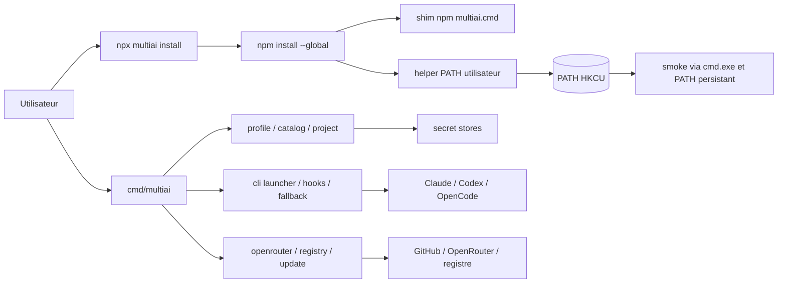
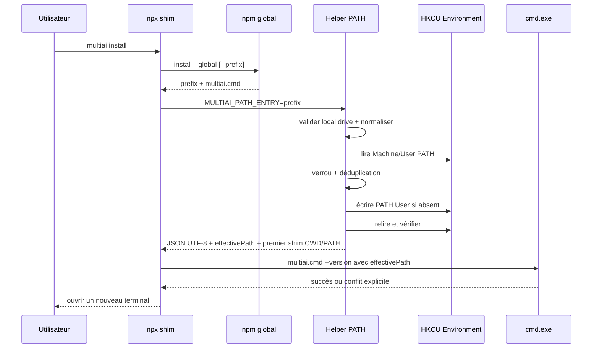

# Audit architecture, code et installation Windows — multiai

**Date :** 2026-07-14
**Auditeur :** Forge (BMAD+ Architect-Dev, avec revue Technical Writer)
**Révision de départ :** `5808769b611b4aa626f50d82482ebc436969d4d6` — `ci: restore cross-platform release checks`
**Périmètre :** architecture, modularité, maintenabilité, fiabilité, performance, portabilité, CLI, packaging, release engineering, dette technique et analyse profonde du PATH Windows.
**Score global de l'état local audité : 5,9/10.**

> **Verdict.** multiai possède un bon cœur de routeur local : peu de dépendances, des packages Go lisibles, une isolation d'environnement explicite, des profils embarqués et des primitives réseau/écriture globalement sérieuses. Le correctif PATH Windows implémenté pendant l'audit traite correctement la rupture d'installation signalée. Le projet n'est néanmoins pas prêt à devenir « le meilleur » tant que ses contrats YAML/projet, son updater, ses canaux de distribution et sa chaîne de release ne correspondent pas aux promesses publiques. Les priorités sont la vérité des contrats et la reproductibilité, pas l'ajout de fonctions.

---

## 1. Description du projet et architecture cible

**multiai est un plan de contrôle local pour les assistants de développement en ligne de commande.** À partir d'un profil, il choisit Claude Code, Codex ou OpenCode, injecte uniquement les paramètres et secrets requis, puis laisse le processus natif dialoguer directement avec le fournisseur choisi. Il ne doit pas devenir un proxy LLM généraliste : son avantage est une politique locale, portable et auditable entre plusieurs CLI.

La cible recommandée est :

```text
Utilisateur / CI
      |
      v
CLI stricte et versionnée
      |
      v
Application (résolution de commande, erreurs typées, orchestration)
      |
      +--> Profils + schémas + héritage --> environnement éphémère
      +--> Secrets OS                  --> valeurs jamais remises en cache
      +--> Process runner par OS       --> arbre de processus contrôlé
      +--> Update par canal            --> npm / Scoop / Homebrew / standalone
      +--> Paths centralisés           --> config / cache / data / logs
      |
      v
Claude Code | Codex | OpenCode
```

### Architecture actuelle observée



Le découpage `cmd` + `internal/*` évite les cycles et rend le domaine repérable. Les faiblesses sont surtout aux frontières : contrats de fichiers, état mutable partagé, processus externes, installation et publication.

---

## 2. Méthode, limites et validations

- Inspection statique du dépôt, des workflows racine et de leur copie sous `multiai-go`, des chemins de lancement, profils, hooks, update, packaging npm et scripts de build.
- Lecture des décisions et incidents déjà consignés dans `.agents/memory/*` ; les changements préexistants du worktree ont été préservés.
- Aucun PATH utilisateur réel n'a été modifié pendant l'audit : le mode `Plan` et les tests isolés ont été utilisés.
- L'état public des canaux n'est pas réévalué ici : le rapport produit couvre cette partie. Le présent rapport juge la cohérence du code et des mécanismes de livraison.

| Validation | Résultat | Interprétation |
|---|---|---|
| `npm test` dans `multiai-go/packaging/npm` | **25/25 réussis** | Tests bootstrap, préflight, arguments npm, helper PATH et smoke Windows verts. |
| `npm pack --dry-run --json` | **réussi** | Le tarball contient `bin/multiai.js`, `lib/windows-path.js` et `scripts/ensure-user-path.ps1`. |
| `go vet ./...` | **réussi** | Aucun défaut vet observé sur la révision locale. |
| Tests ciblés `internal/catalog`, `fsutil`, `profile`, `cli`, `update` | **réussis** | Les composants ciblés terminent individuellement. |
| `go test ./... -count=1 -timeout 90s` | **timeout externe après ~124 s** | La suite complète n'est pas déclarée verte. |
| Test ciblé `cmd/multiai` | **timeout** | Cohérent avec les blocages de sous-processus Windows déjà consignés dans `.agents/memory/context.md:20-24,32`. |

La matrice CI connue est également incomplète : macOS/Ubuntu restent rouges dans le run mémorisé, tandis que Windows, lint, sécurité, GoReleaser et cross-compile étaient verts. Conformément à `.agents/memory/decisions.md:10-14`, aucune publication ne doit partir avant une matrice complète verte.

---

## 3. Score d'architecture

| Dimension | Note | Justification synthétique |
|---|---:|---|
| Structure des packages | **7,5/10** | Domaines lisibles, dépendances limitées, pas de cycles détectés. |
| Maintenabilité | **6,0/10** | Code souvent simple, mais contrats dupliqués, versions et workflows divergents. |
| Testabilité | **6,5/10** | Bonne densité de tests ciblés ; orchestration globale et processus difficiles à borner. |
| Fiabilité | **5,0/10** | Erreurs avalées, updater non persistant et état mutable partagé. |
| Portabilité | **5,5/10** | Bon support OS dans les stores ; chemins et scripts de build fragmentés. Le PATH Windows local est désormais bien traité. |
| Packaging / release | **4,5/10** | Bootstrap npm renforcé, mais canaux, versions, signatures et workflow effectif divergent. |
| Performance | **7,0/10** | Aucun goulet structurel au lancement ; plusieurs lectures réseau non bornées. |
| Observabilité / diagnostic | **6,0/10** | Logs et messages utiles, mais pas de `doctor` ni de vue unique des chemins/versions/canaux. |
| **Global** | **5,9/10** | Base saine, frontières de livraison et contrats encore fragiles. |

### Forces à conserver

- Dépendance directe Go réduite essentiellement à YAML (`multiai-go/go.mod`).
- Packages internes cohérents et 20 packages listables avec `go list ./...`.
- Primitive d'écriture atomique réutilisable et permissions restrictives pour plusieurs données sensibles.
- Clients réseau généralement dotés de contextes et timeouts.
- Catalogue et profils embarqués, avec une base de tests significative.
- Bootstrap npm avec contrôle SHA-256, tests d'intégrité et désormais installation PATH défensive.

---

## 4. Correctif PATH Windows — cause, revue finale et critères de release

### Cause racine historique

Le parcours recommandé `npx ... multiai@latest install` lançait une seconde installation npm globale, puis validait directement le fichier JavaScript situé sous `npm root --global`. Ce smoke test contournait le shim généré et la résolution du shell. Or, sous Windows, npm place le shim global dans son **préfixe** — observé ici comme `C:\Users\laurent\AppData\Roaming\npm` — et cette entrée doit être présente dans `PATH`. L'ancien code ne lisait ni ne modifiait ce PATH et affichait seulement « Open a new terminal ».

### État du correctif local

| Propriété requise | État et preuve |
|---|---|
| Traiter `install` avant d'exiger le binaire temporaire npx | **OK** — `multiai-go/packaging/npm/bin/multiai.js:164-168`, ce qui évite le double téléchargement natif. |
| Résoudre le vrai préfixe npm, y compris `--prefix` custom | **OK** — `multiai-go/packaging/npm/lib/windows-path.js:10-20` et `bin/multiai.js:85-94`. |
| Vérifier l'existence de `<prefix>\multiai.cmd` | **OK** — `lib/windows-path.js:58-61`. |
| User scope, sans admin et sans `setx` | **OK** — `[Environment]::SetEnvironmentVariable('Path', ..., 'User')` à `scripts/ensure-user-path.ps1:222`. |
| Préserver le PATH, normaliser casse/slash/guillemets/variables et rester idempotent | **OK** — `ensure-user-path.ps1:11-73,151-181,203-213`. |
| Refuser UNC, device, chemin relatif, `;`, NUL et CR/LF | **OK** — double validation à `lib/windows-path.js:53-55` et `ensure-user-path.ps1:153-163`; seuls les chemins `X:\...` sont admis. |
| Éviter l'injection en ligne de commande | **OK** — cible transmise uniquement par `MULTIAI_PATH_ENTRY` (`lib/windows-path.js:75-87`). |
| Sérialiser les installations concurrentes | **OK** — mutex local, relecture après verrou à `ensure-user-path.ps1:191-213`. |
| Vérifier l'écriture persistante | **OK** — relecture et contrôle à `ensure-user-path.ps1:224-229`. |
| Détecter le premier shim réellement résolu | **OK** — recherche **CWD puis PATH machine+user** dans le helper, `ensure-user-path.ps1:111-138,149`. Un ancien shim prioritaire fait échouer l'installation. |
| Smoke via le PATH persistant, pas par chemin interne | **OK** — environnement remplacé par le PATH relu puis `cmd.exe /d /s /c multiai.cmd --version`, `bin/multiai.js:129-143`. |
| Employer les outils système de confiance | **OK** — chemins absolus dérivés de `SystemRoot`, `lib/windows-path.js:22-45`. |
| Opt-out entreprise et erreur non silencieuse | **OK** — `MULTIAI_SKIP_PATH_UPDATE=1`; sinon toute erreur d'écriture/vérification retourne 1 avec instruction manuelle (`bin/multiai.js:97-114`). |
| Helper inclus dans l'artefact | **OK** — allowlist package `package.json:29-38`; confirmé par `npm pack --dry-run --json`. |



### Verdict de revue

**Aucun défaut bloquant n'a été trouvé dans l'implémentation PATH actuelle.** Le design est défensif, minimal et respecte la sémantique npm Windows. Les 25 tests npm et le dry-run du paquet sont verts.

Risques résiduels, non bloquants pour le code mais obligatoires avant publication :

1. Exécuter un E2E dans une VM Windows utilisateur standard et cache npm vierge, puis vérifier `multiai --version` dans de **nouvelles** consoles `cmd` et PowerShell.
2. Tester une stratégie d'entreprise qui bloque PowerShell ou l'écriture HKCU et vérifier le message/retour non nul.
3. Tester une course avec un installateur tiers modifiant PATH simultanément ; le mutex protège multiai contre lui-même, pas contre tous les logiciels.
4. Couvrir explicitement PATH utilisateur proche de 32 767 caractères, disque/registre refusé et préfixe Unicode/espaces dans un test `Apply` jetable.
5. Publier ce correctif avant de marquer l'incident fermé : il n'existe encore que dans le worktree audité.

---

## 5. Constats détaillés

### A-01 — P0 critique — Le contrat YAML/projet documenté est largement non fonctionnel

**Preuves.** Le guide promet un fichier multi-profils `~/.multiai/profiles.yaml` avec enveloppe `profiles:` (`multiai-go/docs/advanced/yaml-profiles.md:7-39`) et interpolation `${VAR}` (`:90-102`). Le code parcourt au contraire des fichiers `.yaml/.yml` individuels et décode chacun directement en `ProfileYAML` (`multiai-go/internal/profile/yaml.go:15-50,52-100`). L'expansion runtime ne traite que `%VAR%` (`multiai-go/internal/env/env.go:40-78`). Le guide projet utilise `project:`, `profiles:` et `extends:` (`multiai-go/docs/advanced/project-config.md:16-40,62-75`), alors que `FindProjectConfig` décode tout le document en un `ProfileYAML` plat (`multiai-go/internal/profile/project.go:13-36`). `runLaunch` fusionne directement ce résultat sans résoudre profil par défaut, héritage ou cycle (`multiai-go/cmd/multiai/main.go:452-459`). Enfin, la documentation représente les hooks comme chaînes, mais le code exige des listes de `HookCommand` (`multiai-go/internal/profile/yaml.go:40-50`). Les champs inconnus ne sont pas refusés.

**Impact.** Une configuration valide selon la documentation peut être silencieusement ignorée ; un utilisateur croit appliquer une politique d'équipe alors que le profil global continue. C'est un défaut de fiabilité et, pour les endpoints/hooks, une frontière de confiance ambiguë.

**Correction.** Définir deux schémas versionnés — `UserProfilesFile` et `ProjectFile` —, activer `KnownFields`, limiter la taille, résoudre un DAG d'héritage avec détection de cycles et deep copy, choisir une seule syntaxe d'interpolation, puis transformer tous les exemples de documentation en fixtures golden exécutées en CI. Jusqu'à livraison, retirer ou marquer expérimental le contrat actuel.

### A-02 — P0 critique — L'auto-update n'installe pas durablement la nouvelle version

**Preuves.** Le téléchargement extrait l'exécutable dans `os.MkdirTemp` et retourne ce chemin (`multiai-go/internal/update/update.go:335-358`). `execNewBinary` démarre cette copie temporaire puis quitte (`:391-403`) ; aucune copie atomique, aucun rollback et aucun nettoyage de succès ne remplacent l'exécutable installé. `cmd_update.go:129-137` présente pourtant l'opération comme une mise à jour. Plus grave, un contrôle automatique est lancé en goroutine à chaque démarrage (`multiai-go/cmd/multiai/main.go:207`) et peut arriver jusqu'à l'exécution/quitter via `update.Check` (`update.go:55-81`).

**Impact.** Après redémarrage, l'ancienne version revient. Une vérification en arrière-plan peut interrompre une commande active, et le comportement dépend du canal d'installation sans le connaître.

**Correction.** **P0 :** rendre le check automatique strictement notification-only. **P1 :** mémoriser le canal et déléguer à npm/Scoop/Homebrew/APT/AUR ; pour un binaire autonome seulement, utiliser un helper de remplacement atomique, sauvegarde, rollback, reprise après crash et vérification post-redémarrage. Aucun `os.Exit` ne doit vivre dans la bibliothèque update.

### A-03 — P0 critique — Le workflow de release effectif n'est pas la copie renforcée

**Preuves.** GitHub n'exécute que `.github/workflows/*`, mais le dépôt maintient aussi `multiai-go/.github/workflows/*` et un script de synchronisation manuel (`multiai-go/scripts/sync-workflows.ps1:23-65`). Le diff local montre que la copie sous-module possède préflight master/tag, tests/vet et job APT absents ou divergents dans la racine ; inversement la racine contient des ajustements npm/Windows absents de la copie. Le workflow racine lance GoReleaser après les seuls contrôles de version (`.github/workflows/release.yml:31-75`) sans dépendre d'une matrice tests/lint/sécurité verte. Cela contredit la décision de non-publication avant CI complète (`.agents/memory/decisions.md:10-14`).

**Impact.** Un tag peut publier des artefacts depuis un SHA non qualifié, tandis qu'un mainteneur peut renforcer le mauvais fichier en pensant sécuriser la production.

**Correction.** Garder **une seule** source à la racine, supprimer copie et synchronisation, imposer branche/tag descendant, checks requis pour le SHA exact, environnement `release` protégé et smoke post-publication par canal. Pinner actions/outils et attacher les preuves SBOM/signature au même pipeline.

### A-04 — P0 critique — Les canaux, versions et commandes d'installation divergent

**Preuves.** Le module annonce `github.com/lrochetta/multiai` (`multiai-go/go.mod:1`) alors que `go.mod` est dans `multiai-go`; le README racine propose un chemin incluant `/multiai-go/cmd/multiai`, tandis que d'autres guides proposent le module sans `/cmd`. Les versions observées divergent : fallback binaire et Makefile `0.6.0`, package npm `0.6.7`, manifeste de profils `0.5.0`, PKGBUILD AUR `0.4.0` avec `sha256sums=('SKIP')`. Homebrew/Scoop sont annoncés mais désactivés/commentés dans `multiai-go/.goreleaser.yaml:132-151`; le script PowerShell d'installation documenté n'existe pas dans `multiai-go/scripts`. Le script Unix continue lorsque les checksums manquent (`multiai-go/scripts/install.sh:181-187`).

**Impact.** Les builds, messages `version`, profils embarqués et gestionnaires peuvent publier des états incompatibles. Certaines méthodes échouent avant même d'atteindre le produit ; le bootstrap Unix devient fail-open.

**Correction.** Établir un manifeste de capacité généré par la release et n'annoncer qu'un canal smoke-testé après publication. Choisir soit un module à la racine, soit un chemin module incluant `/multiai-go` avec tags de sous-module cohérents. Dériver la version depuis `debug.ReadBuildInfo`/ldflags et une source de release unique. Rendre checksum/signature obligatoires et retirer immédiatement les commandes fantômes.
