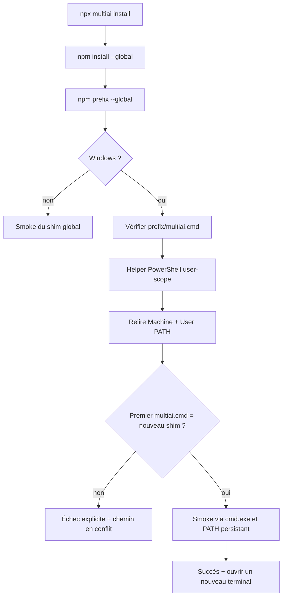

# Correctif Windows — automatisation du PATH npm

**Date :** 2026-07-14
**Statut :** implémenté localement, revu par Forge et Sentinel, non publié
**Périmètre :** parcours explicite `npx --yes --allow-scripts=multiai multiai@latest install`

## Résultat

Le défaut initial est corrigé dans le worktree : l'installation explicite
Windows découvre désormais le préfixe global npm, vérifie le shim généré,
ajoute le préfixe au `PATH` utilisateur s'il manque, contrôle le premier shim
qui sera réellement résolu, puis lance le smoke test via ce `PATH` persistant.

L'opération :

- est idempotente et limitée au compte utilisateur ;
- ne demande aucun droit administrateur ;
- n'utilise jamais `setx` ;
- conserve l'ordre et le contenu du `PATH` existant ;
- refuse les chemins relatifs, UNC, device, ou contenant `;`, NUL, CR/LF ;
- transmet le préfixe à PowerShell par variable d'environnement, sans
  interpolation dans du code shell ;
- échoue explicitement si un ancien ou autre `multiai.cmd` masque le nouveau ;
- propose `MULTIAI_SKIP_PATH_UPDATE=1` pour un poste administré ;
- explique qu'un processus enfant ne peut pas modifier le terminal déjà ouvert.

## Cause racine

Le flux historique exécutait bien `npm install --global`, mais son smoke test
appelait directement :

```text
node <npm-root>/multiai/bin/multiai.js --version
```

Il prouvait la présence du package, pas la résolution de la commande. Aucun
code ne demandait `npm prefix --global` et aucun code ne persistait ce dossier
dans le `PATH` utilisateur.

Cette distinction est déterminante sous Windows : npm place les exécutables
globaux directement dans `{prefix}` et demande que ce dossier soit dans
`PATH` ([documentation npm](https://docs.npmjs.com/cli/v11/configuring-npm/folders/)).

## Architecture du correctif



### Orchestration npm

- `bin/multiai.js:82-92` obtient le préfixe réel et conserve un éventuel
  `--prefix` personnalisé.
- `bin/multiai.js:94-110` applique le correctif Windows et traite les erreurs.
- `bin/multiai.js:114-151` compare le premier shim résolu au shim attendu et
  smoke-teste `multiai.cmd` par son nom.
- `bin/multiai.js:164-168` traite `install` avant d'exiger le binaire du cache
  npx, évitant un double téléchargement inutile.

### Frontière Node.js

- `lib/windows-path.js:47-66` valide un chemin local de type `C:\...` et la
  présence du shim.
- `lib/windows-path.js:68-90` appelle le PowerShell système par chemin absolu,
  avec timeout et préfixe transmis uniquement dans l'environnement.
- `lib/windows-path.js:92-110` parse un résultat JSON UTF-8 strict et échoue
  sur tout résultat inattendu.

### Mutation PowerShell

- `scripts/ensure-user-path.ps1:9-78` normalise les entrées sans modifier les
  valeurs existantes.
- `scripts/ensure-user-path.ps1:111-151` reconstruit le `PATH` persistant
  Machine + User et détermine le premier `multiai.cmd` résolu, y compris un
  conflit depuis le répertoire courant.
- `scripts/ensure-user-path.ps1:158-168` refuse les chemins non locaux et
  vérifie le shim avant toute mutation.
- `scripts/ensure-user-path.ps1:191-229` sérialise les installateurs concurrents
  par mutex, relit avant écriture, persiste au scope User et vérifie après
  écriture.

`Environment.SetEnvironmentVariable(..., User)` stocke la valeur dans
`HKEY_CURRENT_USER\Environment`, la propage à l'Explorateur et notifie les
applications avec `WM_SETTINGCHANGE` ([documentation Microsoft](https://learn.microsoft.com/en-us/dotnet/api/system.environment.setenvironmentvariable?view=net-10.0)).

## Tests et preuves exécutées

| Contrôle | Résultat |
|---|---:|
| `npm test --prefix multiai-go/packaging/npm` | **25/25 PASS** |
| Plan PowerShell réel sur Windows | **PASS** |
| PATH vide / déjà présent / Machine / `%VAR%` | **PASS** |
| Casse, slash final, guillemets | **PASS** |
| Préfixe avec espaces et Unicode | **PASS** |
| Shim concurrent prioritaire détecté | **PASS** |
| Chemins relatifs, `;`, UNC et device refusés | **PASS** |
| Échec PowerShell propagé | **PASS** |
| Résolution `.cmd` par `cmd.exe` via PATH | **PASS** |
| `node --check` sur shim/helper/tests | **PASS** |
| `npm pack --dry-run --json` | **PASS — 7 fichiers, helpers inclus** |
| `node scan-secrets.js` | **PASS — 54 profils, aucune clé réelle** |
| `git diff --check` | **PASS, avertissements CRLF préexistants** |

Les tests sont situés dans :

- `packaging/npm/bin/multiai.test.js:60-68` pour le préfixe npm ;
- `packaging/npm/lib/windows-path.test.js:46-167` pour validation,
  idempotence, Unicode et conflit ;
- `packaging/npm/lib/windows-path.test.js:170-191` pour la résolution réelle
  du `.cmd` via `PATH`.

## Limites et gate de publication

Le test n'a volontairement pas modifié le vrai `PATH` de la machine de
développement : le helper a été exercé en mode `Plan`. Avant publication,
exécuter une E2E dans une VM Windows jetable avec utilisateur standard :

1. retirer le préfixe npm du `PATH` utilisateur ;
2. installer depuis le tarball exact à publier ;
3. fermer le processus installateur ;
4. ouvrir une nouvelle console `cmd`, puis une nouvelle console PowerShell ;
5. vérifier `where multiai`, `Get-Command multiai` et `multiai version` ;
6. relancer l'installation et confirmer l'absence de doublon ;
7. recommencer avec un préfixe personnalisé contenant espaces et Unicode ;
8. restaurer la VM.

Un simple `npm install --global multiai` ne déclenche pas cette mutation : il
reste dépendant d'un préfixe npm déjà présent dans `PATH`. La commande explicite
documentée ci-dessus est le contrat automatisé.
