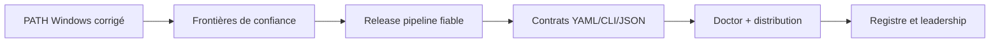

# Roadmap priorisée — de 5–6/10 à une référence

**Date :** 2026-07-14
**Pilote suggéré :** Nexus
**Principe :** fiabiliser les promesses et les frontières de confiance avant
d'ajouter des fonctions.

## Critère de succès produit

> multiai devient le plan de contrôle local de référence pour lancer plusieurs
> agents de code CLI avec des profils reproductibles, des secrets isolés et
> une chaîne d'installation vérifiable.

Le parcours primaire à optimiser est :

```text
installer -> vérifier -> configurer une clé -> lancer un profil -> relancer demain
```

## P0 — Bloqueurs de release (0–7 jours)

| Ordre | Chantier | Propriétaire | Effort | Definition of Done |
|---:|---|---|---:|---|
| 1 | Confiance projet `.multiai.yaml` | Forge + Sentinel | L | Aucun hook, endpoint ou override sensible n'est appliqué avant approbation explicite liée au chemin canonique et à une empreinte ; non-interactif fail-closed ; tests symlink/parent/modification. |
| 2 | Confinement du registre | Forge | S | Nom strict `^[a-z0-9][a-z0-9_-]{0,63}$`, contrôle `Abs/Rel`, refus volume/UNC/traversal/reparse, taille maximale, checksum obligatoire ; tests Windows/POSIX. |
| 3 | Neutraliser l'auto-update dangereux | Forge | M | Le check de démarrage notifie seulement ; aucun `os.Exit` depuis une goroutine ; `multiai update` délègue au gestionnaire ou réalise un swap atomique signé et persistant avec rollback. |
| 4 | Réparer la gate de release réelle | Nexus + Sentinel | M | Workflow racine synchronisé et unique ; tests multi-OS/race/vet obligatoires pour le SHA tagué ; environnement release protégé ; Gitleaks/gosec/govulncheck bloquants et pinés. |
| 5 | Finir les tests cross-platform 0.6.7 | Sentinel | M | Correctifs macOS/Ubuntu du handoff terminés ; processus de test bornés ; matrice complète verte sur le même commit. |
| 6 | E2E Windows du correctif PATH | Sentinel | S | Tarball installé dans VM vierge utilisateur standard ; nouvelle console cmd + PowerShell ; exact shim résolu ; réinstallation sans doublon ; espaces/Unicode/custom prefix. |
| 7 | Vérité documentaire immédiate | Atlas | S | Seuls les canaux, commandes, versions et nombres de profils réellement publics sont marqués disponibles ; liens morts retirés ou étiquetés planifiés. |

### Gate P0

Aucun tag, aucune release GitHub et aucun `npm publish` tant que les sept
lignes ne sont pas fermées. Cette gate complète la décision mémoire existante
qui exige déjà une matrice CI entière verte.

## P1 — Contrats fiables (1–4 semaines)

| Ordre | Chantier | Résultat attendu | Mesure |
|---:|---|---|---|
| 1 | Schéma unique profils/projet/hooks | JSON Schema versionné, décodage strict (`KnownFields`), `extends` réel, validation et migration. | 100 % des exemples YAML exécutés en CI. |
| 2 | CLI stricte et automatisable | Flag inconnu = exit 2 ; `--timeout` implémenté ou retiré ; stdout JSON pur ; aide/completion issues du même registre. | Chaque commande/flag public possède un test contractuel. |
| 3 | `multiai doctor` | Vérifie chemins, stores, CLIs, PATH, version, registry, config projet et canaux d'installation ; propose des fixes explicites. | Diagnostic de l'installation en une commande. |
| 4 | Frontières réseau bornées | Limites `Content-Length`, lecteurs limités, nombre/taille d'archives, timeouts, nettoyage des temporaires. | Tests dépassement mémoire/disque et serveur lent. |
| 5 | Supply chain signée | Cosign/provenance produits systématiquement et vérifiés fail-closed ; même racine de confiance npm/updater. | Artefact absent/invalide/mauvaise identité toujours refusé. |
| 6 | Tests de processus déterministes | `CommandContext`, timeout par test, kill de l'arbre, diagnostics ; suites unitaires/OS/E2E séparées. | Zéro timeout muet, durée CI bornée. |
| 7 | Cycle de vie des profils | add/show/edit/validate/update/remove/export ; répertoire et permissions cohérents. | Parcours complet E2E et rollback. |

## P2 — Leadership de catégorie (1–3 mois)

1. Registre communautaire signé avec provenance, compatibilité minimale,
   gouvernance publique et revue automatique.
2. Politiques projet portables : fournisseur/région/fallback/contexte, sans
   recréer un proxy ; génération de politiques OpenRouter/LiteLLM.
3. SDK d'adaptateur pour ajouter un CLI sans modifier le cœur, avec matrice de
   capacités.
4. Documentation, aide et completions générées depuis le code ; snippets
   exécutables dans la CI.
5. i18n FR/EN complète et sorties machine indépendantes de la langue.
6. Canaux Homebrew/Scoop/APT/AUR activés uniquement avec smoke tests publics
   quotidiens et rollback.
7. Historique et diagnostics locaux ; télémétrie uniquement opt-in, minimale
   et documentée.

## KPI proposés

| Horizon | KPI | Cible |
|---|---|---:|
| Release suivante | Installations Windows propres résolues par nom | 100 % |
| Release suivante | Gates P1 sécurité ouvertes | 0 |
| Release suivante | Matrice CI du SHA publié | 100 % verte |
| 30 jours | Installation → premier dry-run médian | < 2 min |
| 30 jours | Premier lancement réussi | > 85 % |
| 60 jours | Lancements sans erreur | > 95 % |
| 60 jours | Utilisateurs actifs utilisant ≥ 2 CLI | > 20 % |
| 90 jours | Profils communautaires validés | ≥ 10 |
| 90 jours | Contributeurs externes actifs | ≥ 5 |

## Séquencement recommandé



Le gain principal ne vient pas d'un plus grand nombre de fournisseurs. Il
vient d'une installation fiable, de contrats stricts, d'une sécurité
fail-closed et d'une documentation qui ne promet que ce qui est exécutable.
